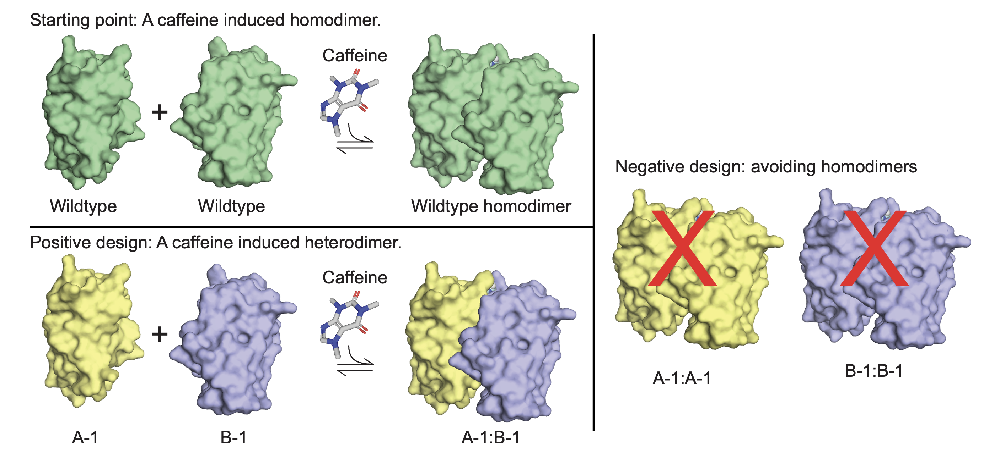

# caffeine-multi-state-design

**caffeine-multi-state-design** (varCOMETS) is a Python-based program developed by the Laboratory of Protein Design and Immunoengineering (LPDI) at EPFL for multi-state design. It focuses on multi-state protein design, aiming to optimize protein sequences that can adopt multiple conformations or functional states. This implementation was used to design **caffeine-inducible nanobody heterodimers** with minimized off-target homodimerization, enabling precise control of cellular signaling in synthetic biology applications.

If you use this code please cite our paper [1], and the original COMETS multi-state design paper [2].



## Features

- Implements multi-state design algorithms to identify sequences compatible with multiple protein states.
- Utilizes Python/pymol for scripting.
- Incorporates Rosetta tools for energy calculations, rotamer sampling, and structural analysis.

## System Requirements
This code requires python 2.7 and python 2.7-based pymol to run. You must run it in your local machine.

Energy matrices for the problems in the paper are provided in this repository. However, if you wish to apply this code to a different problem, Rosetta is required to compute intrabody and pairwise energy matrices for residues. Thus, you must use Rosetta to compute these matrices as in the format of the files in the ``Rosetta_energy_matrices/`` directory.

## Installation

To use this repository, clone it to your local machine:

```bash
git clone https://github.com/LPDI-EPFL/caffeine-multi-state-design.git
cd caffeine-multi-state-design
```


## Runtime
The running time of the scripts, as currently set up, is within a second, and can be run in a laptop. However, varCOMETS is a provable algorithm, meaning that it guarantees to identify the global minimum within the search space. Since the complexity of the problem is not polynomial (see [2]), as the number of designed residue positions grows, the space grows and the run time can become unfeasible. Therefore, care should be taken when selecting residues to model. Probably keeping it at 5-7 residues max is necessary and these must be carefully selected. Although an HPC server can likely process larger inputs, the problem still has exponential complexity which can catch up to available resources with a slighly larger input.

## Usage
The main script for running the multi-state design is ``msd_caf.py``. To execute the design process as shown in the paper, run it with the provided residue groups, and the precomputed energy matrices: 

```bash
python msd_caf.py caffeine A # for group A
python msd_caf.py caffeine B # for group B
python msd_caf.py caffeine C # for group C
python msd_caf.py caffeine D # for group D
```

To visualize results: 
```bash
pymol
```

Within pymol run: 
```bash
run show_in_pymol output/caffeine/caffeine_A.json
```


## Repository Structure

``msd_caf.py``: Entry point for the caffeine design

``show_in_pymol.py``: Utility script to visualize structures and designs in PyMOL.

``varbnb/VarbnbMSD.py``: Algorithm for multi state design

``bp/``: Belief propagation algorithm used to compute lower bounds 

``mplp``: MPLP algorithm used to compute upper bounds.

``dynamicAS``: Dynamic A* algorithm used to explore the multi-state design space.

``ematrix``: Directory to parse Rosetta energy matrices.

``test-mplp-orig.py, test_pyrosetta.py``: Test scripts for validating design methods.

``input/``: Directory containing the definition of the states and the regions being modeled, as well as allowed amino acids.

``output/``: Directory where output files, including designed sequences and structures, are saved.

``Rosetta_energy_matrices/``: contains the energy matrices for the design as computed by Rosetta. 

## License
This project is licensed under the MIT License. See the LICENSE file for details.

## References
If you use this code, please cite:

[1] Scheller L. et al. _"Humanized Caffeine-Inducible Systems for Controlling Cellular Functions"_, 2025

[2] Hallen M. & Donald B.R., _"COMETS (Constrained Optimization of Multistate Energies by Tree Search): A provable and efficient protein design algorithm to optimize binding affinity and specificity with respect to sequence."_ Journal of Computational Biology 23.5 (2016): 311-321.


